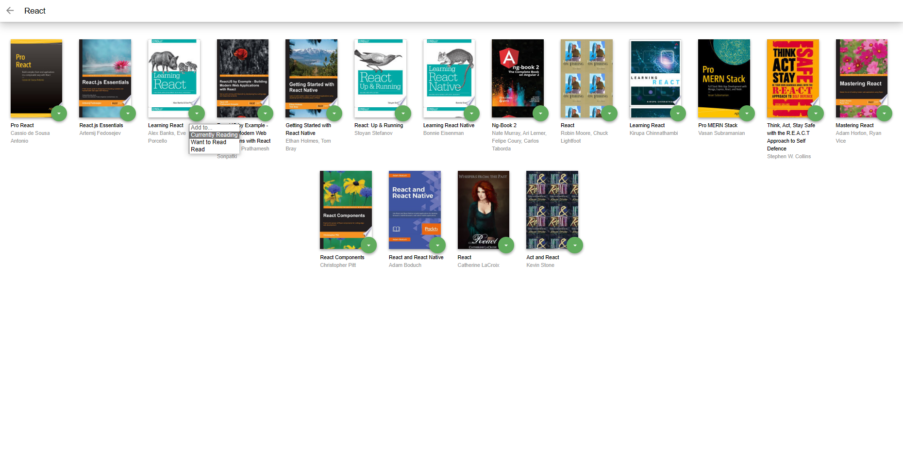
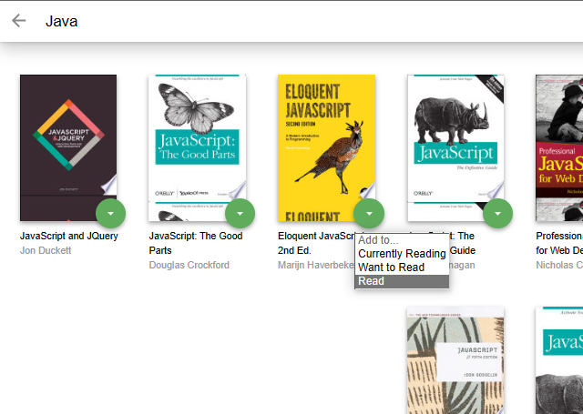

# MyReads Project

This is the repository for the MyReads project, a book tracking app that allows users to categorize books into "Currently Reading", "Want to Read", and "Read". This project was created as part of the Udacity Front-End Web Developer Nanodegree program.

Link to the deployed app: https://bardala.github.io/a-book-tracking-app/

## Main Page

The main page shows 3 shelves for books. Each book is displayed with its title and all of its authors. The main page has a control that allows users to move books between shelves. The control is tied to each book instance and the state of the book is not changed when the page is refreshed.

When the browser is refreshed, the same information is displayed on the page.

## Search Page

The search page has a search input field. As the user types into the search field, books that match the query are displayed on the page, along with their titles and authors. Search results are not shown when all of the text is deleted out of the search input box. Invalid queries are handled and prior search results are not shown. The search works correctly when a book does not have a thumbnail or an author.

The user is able to search for multiple words, such as "artificial intelligence".

## Routing

The main page contains a link to the search page. When the link is clicked, the search page is displayed and the URL in the browser's address bar is /search. The search page has a link to the main page. When the link is clicked, the main page is displayed and the URL in the browser's address bar is /.

## Code Functionality

- Component state is passed down from parent components to child components.
- The state variable is not modified directly.
- The setState() function is used correctly.
- All JSX code is formatted properly and functional.
- There are no JS errors in the console.

## Installation

To install and run the app locally:

1. Clone this repository: `git clone https://github.com/Bardala/a-book-tracking-app.git`
2. Install dependencies: `npm install`
3. Start the development server: `npm start`

The app should now be running on http://localhost:3000.

## Credits

This project was developed by Bardala as part of the Udacity Front-End Web Developer Nanodegree program.
